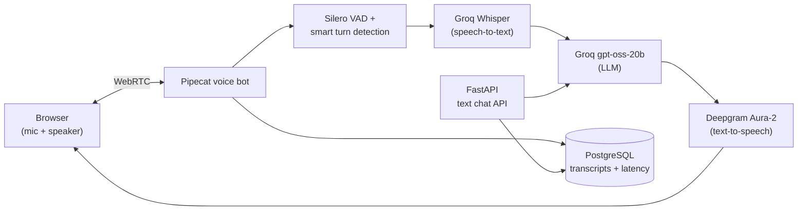

# AI Voice Sales Assistant

An embeddable, real-time **voice sales assistant** for business websites. A visitor clicks "Talk to us", speaks through the browser, and the assistant answers, asks qualifying questions, and hands off to the sales team.

> **Status:** working demo, in active development. It is **not production-ready** yet (see [Known limitations](#known-limitations) and [Roadmap](#roadmap)).

---

## Demo

Demo video: *coming soon*

---

## What works today

| Feature | Details |
|---|---|
| **Real-time voice in the browser** | Pipecat pipeline over WebRTC: speech-to-text → LLM → text-to-speech |
| **Turn-taking** | Silero VAD plus a smart-turn model to decide when the visitor has finished speaking |
| **Barge-in** | The bot stops talking when the visitor interrupts; only the words actually spoken are kept in context |
| **Instant greeting** | Fixed greeting spoken through TTS, skipping the LLM call on connect |
| **Conversation memory** | The bot remembers details within a call (e.g. the visitor's name) |
| **Grounding rules in the prompt** | The bot is instructed not to invent prices, features or bookings and to pass such questions to the sales team |
| **Text chat API** | `POST /v1/conversations` and `POST /v1/conversations/{id}/messages` |
| **Transcripts saved** | Text and voice conversations stored in PostgreSQL |
| **Per-turn latency tracking** | STT, LLM and TTS time-to-first-byte plus total voice-to-voice latency stored per message, with a p50/p95 report script |
| **Swappable TTS provider** | `TTS_PROVIDER=groq` or `deepgram` in `.env`, no code change |
| **Multi-tenant-ready schema** | Every table carries `organization_id`; a composite foreign key stops a conversation from linking to another company's agent, covered by a test |
| **Health checks** | `/healthz` (liveness) and `/readyz` (Postgres + Redis) |

---

## Architecture



---

## Tech stack

| Layer | Choice |
|---|---|
| Backend API | Python 3.12, FastAPI, Pydantic v2 |
| Voice pipeline | Pipecat (SmallWebRTC transport, Silero VAD, smart turn detection) |
| Speech-to-text | Groq Whisper |
| LLM | Groq `openai/gpt-oss-20b` |
| Text-to-speech | Deepgram Aura-2 (Groq Orpheus also supported) |
| Database | PostgreSQL 16 (pgvector image), SQLAlchemy 2 async, Alembic migrations |
| Cache | Redis |
| Local infra | Docker Compose |
| Tests | pytest (15 tests; LLM calls replaced with a fake client, so tests use no API quota) |

---

## Measured latency

Measured on a **local development setup** (Windows laptop, Docker, free/trial API tiers), across **6 test calls following the same 8-line English script**. These are real measurements from this project, not vendor benchmarks, and they will vary with network and provider load.

| Stage | Samples | p50 | p95 |
|---|---|---|---|
| Speech-to-text (Groq Whisper) | 49 | 549 ms | 895 ms |
| LLM first token (Groq gpt-oss-20b) | 45 | 511 ms | 610 ms |
| Text-to-speech first audio (Deepgram) | 56 | 331 ms | 433 ms |
| **Visitor stops speaking → bot starts speaking** | 43 | **1,751 ms** | **4,323 ms** |

**What the data showed:**
- LLM and TTS stay fast even at p95. The slow tail in total latency comes mainly from **fragmented visitor turns**, where a pause mid-sentence is treated as the end of a turn. Turn detection is the next optimisation target.
- The first LLM-generated greeting was slow in early sessions (several seconds), so the greeting was switched to fixed text spoken directly through TTS.
- Groq's free-tier TTS hit its daily token limit during testing; the TTS provider was switched to Deepgram through configuration.

Run the report yourself:

```bash
python -m scripts.latency_report
```

---

## Engineering decisions

- **Cascaded pipeline (STT → LLM → TTS) instead of speech-to-speech.** Keeps a text step in the middle where retrieval, policy checks and logging can be added later.
- **Fixed greeting.** Removes an LLM call from the first second of every session.
- **Provider abstraction for TTS.** A free-tier limit should mean a config change, not a rewrite.
- **Latency stored as JSONB per message.** New metrics can be added without a migration, and each row records the settings used (e.g. TTS provider), so experiments can be compared fairly.
- **Tenant guard in the database, not only in code.** Composite foreign keys reject cross-company links even if application code has a bug.
- **Failures don't break the call.** If saving a message fails, the error is logged and the conversation continues.

---

## Known limitations

- **No product knowledge yet.** Without documents (RAG), the bot cannot answer product questions and occasionally overstates what the product can do.
- **Leads are not captured.** The bot may ask for contact details, but they are not saved yet.
- **Guardrails are prompt-only.** The bot sometimes implies the sales team will follow up at a specific time.
- **Noisy environments** cause speech-to-text errors.
- **Visitor turns can split into fragments** when the visitor pauses mid-sentence.
- **No authentication** on the voice bot or chat API. Run it on `localhost` only.
- **English only** for voice.

---

## Getting started

### Prerequisites

- Python 3.12
- Docker Desktop
- A [Groq](https://console.groq.com) API key
- A [Deepgram](https://console.deepgram.com) API key
- Chrome, and headphones for voice testing

### Setup

```bash
git clone https://github.com/AshishChaubey2003/ai-voice-sales-agent.git
cd ai-voice-sales-agent

python -m venv .venv
# Windows:        .venv\Scripts\activate
# macOS / Linux:  source .venv/bin/activate

pip install -r requirements.txt
```

Create your environment file and fill in real values (strong passwords, API keys):

```bash
cp .env.example .env
```

> Never commit `.env`. It is listed in `.gitignore`.

Start Postgres and Redis, create the tables, and add a demo company and agent:

```bash
docker compose up -d
alembic upgrade head
python -m scripts.seed_demo
```

Copy the printed `agent_id` into `VOICE_AGENT_ID` in `.env`.

Ports used locally: Postgres `5433`, Redis `6380`, API `8001`, voice bot `7860`.

### Run the tests

```bash
python -m pytest -v
```

### Run the text chat API

```bash
python -m uvicorn api.main:app --reload --host 127.0.0.1 --port 8001
```

Open http://127.0.0.1:8001/docs to try the endpoints.

### Run the voice bot

```bash
python -m voice.bot -t webrtc
```

Open http://localhost:7860, keep the transport on **SmallWebRTC**, click **Connect**, and start talking.

---

## Project structure

```
api/            FastAPI app, config, database models, chat endpoints, LLM client
voice/          Pipecat voice bot, turn recorder, metrics observer, stats helpers
scripts/        Demo data seeding and latency report
migrations/     Alembic database migrations
tests/          pytest suite
docker-compose.yml
```

---

## Roadmap

- [x] FastAPI, PostgreSQL, Redis, health checks
- [x] Database schema, migrations, tenant guard test
- [x] Text chat with Groq LLM
- [x] Real-time voice pipeline with barge-in
- [x] Voice transcripts and per-turn latency tracking
- [ ] Knowledge base (RAG) so answers come from company documents
- [ ] Lead capture with consent
- [ ] Embeddable website widget
- [ ] Better turn detection (merge fragmented visitor turns)
- [ ] LangGraph agent orchestration
- [ ] Controlled tool access (calendar booking, CRM) with a permission model
- [ ] Authentication, rate limiting, PII handling
- [ ] Automated evaluation suite
- [ ] Observability and production deployment

---

## Author

**Ashish Kumar Chaubey**, Python backend and GenAI developer
GitHub: [@AshishChaubey2003](https://github.com/AshishChaubey2003)
